# 🧠 Jules Code Team Template

### A Drop-in Multi-Agent AI Coding Squad

  

**Stop coding alone.** This template scaffolds a complete "Coding Squad" architecture into your new project. It turns a standard LLM session into a simulated team of specialized agents who debate, critique, and verify your code before it ships.

---

## ⚡ Quick Start

**Do not clone this repo manually.** Use the initialization script to wake up the agents and configure your project.

### 1. Initialize the Squad
Run the onboarding script to configure your team, set governance, and unpack the project structure.
*(Requires Python 3+. No external dependencies or installation needed).*

```bash
python template_source/scripts/init_project.py

```

### 2. Answer the "Interview"

**Brain** will wake up and ask you:

* **Mission:** What are we building? (SaaS, Game, Library?)
* **Governance:** Democracy (Debate) or Dictatorship (Speed)?
* **Risk Tolerance:** High (Move fast) or Low (Security first)?

*The script will then unpack the agent system, configure the personas, and prepare your repository for work.*

---

## 👥 Meet The Squad

This template is not just prompts; it's a **System of Adversarial Interoperability**. Agents have conflicting goals to ensure balance.

| Agent | Role | Focus |
| --- | --- | --- |
| **Brain** 🧠 | **The Architect** | Dialectic simulation. Resolves disputes and enforces the Roadmap. |
| **Boom** 💥 | **Product** | Features & "Vibes". Wants to ship MVP *now*. |
| **Bolt** ⚡ | **Performance** | Speed & Efficiency. Hates O(n^2) complexity and bloat. |
| **Sentinel** 🛡️ | **Security** | Paranoid defense. Checks for injection, CVEs, and bad patterns. |
| **Scope** 🔬 | **QA & Testing** | The Cynic. "Everything breaks." Writes edge cases and stress tests. |
| **Scribe** 📜 | **Docs** | The Historian. Ensures `TEAM_MEMORY.md` is updated and code is readable. |
| **Orbit** 🛰️ | **DevOps** | Infrastructure & CI/CD. Handles release management and containers. |
| **Palette** 🎨 | **UX/UI** | Accessibility & Design. Fights for the user's experience. |

---

## 🏗️ Architecture

How does it work?

```mermaid
graph TD
    User[User Input] --> Brain[🧠 Brain: Architect]
    Brain -->|Simulate Standup| Debate[🗣️ Squad Debate]

    subgraph "The Squad"
    Debate --> Boom[💥 Features]
    Debate --> Bolt[⚡ Speed]
    Debate --> Sentinel[🛡️ Security]
    end

    Debate -->|Consensus| Plan[📝 Implementation Plan]
    Plan --> Code[💻 Code Generation]
    Code -->|Verify| Scope[🔬 Scope: Edge Cases]
    Scope -->|Pass| Scribe[📜 Scribe: Memory Log]
    Scribe --> Output[Final Output]

```



## 🚀 Why use this?

1. **Vibe Coding with Seatbelts:** Enjoy the speed of AI coding, but with **Sentinel** and **Scope** ensuring you don't commit security vulnerabilities or logic bugs.
2. **Context Awareness:** The system uses `smart_ingest.py` to maintain a token-optimized "Memory" of your project, so you don't have to copy-paste files constantly.
3. **Clean Architecture:** All agent logic is hidden in `.agents/`. Your `src/` folder stays clean.

---

## 🤝 Contributing

We welcome "Vibe Coders" and prompt engineers! Please read [CONTRIBUTING.md](https://www.google.com/search?q=CONTRIBUTING.md) before submitting a Pull Request.

## 📄 License

This project is licensed under the [MIT License](https://www.google.com/search?q=LICENSE).
